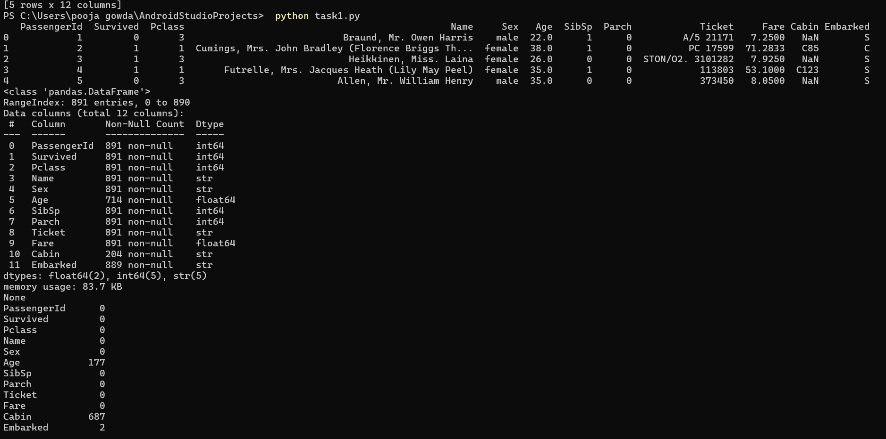
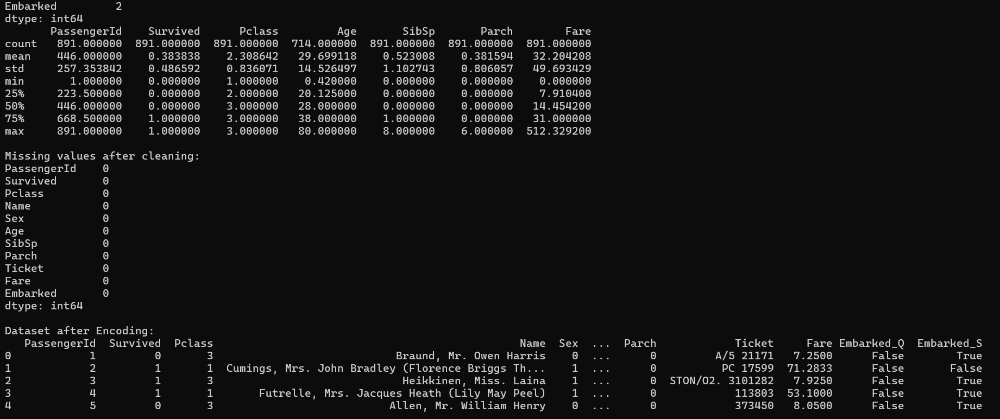
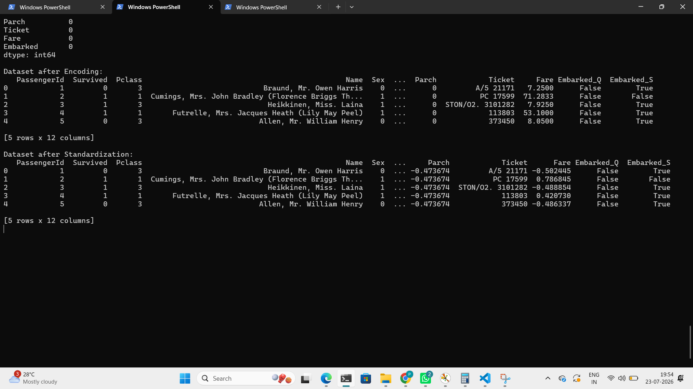
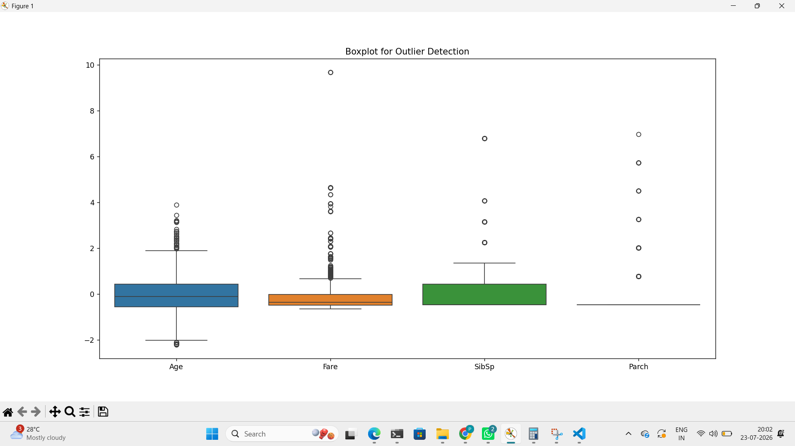

##TASK 1 DATA CLEANING AND PROCESSING
##DATASET - Titanic-Dataset.csv
##TOOLS
-python
-pands
-numpy
-matplotlib
-seaborn
##PERFORMED 
1.loaded the Titanic dataset
2.Explored using head(),info(),describe() and isnull()
3.Filled missing values in Age and Embarked columns
4.Dropped cabin column
5.Encoded categirized columns
6.Standardizition of numeric values
7.Detected outliers
##FILES
1.task.py
2.Titanic-Dataset.csv
3.README.md
##OUTPUT
Dataset is cleaned ,encoded,standardize and visualized
## OUTPUT

Dataset is cleaned, encoded, standardized, and visualized.

### Output 1

### Output 2

### Output 3

### Boxplot for Outlier Detection

